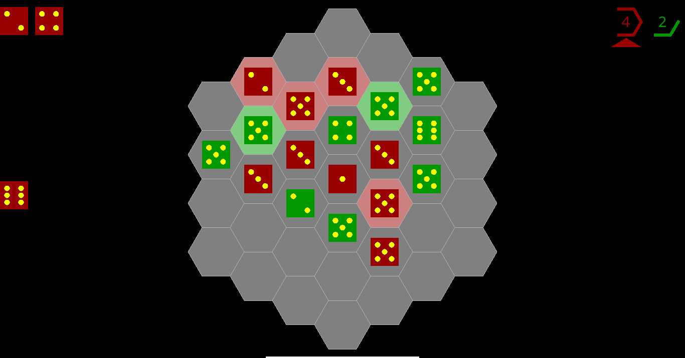

37.6 - A Strategic Game of Dice Placement
=========================================

An electronic version of Artem Borovkov's 37.6 

Youtube: http://youtu.be/z4mxD9EQsJs
      
Rules
=====

For two to five players (the official version of the game is for two players)

1. **Setup**: Each player has 12 dice that are placed in a stack
   to the side of an empty hex board.

2. **Action**: Players take turns to **select** and then **place** a die.
    
    - **Select**: player selects and rolls one of their dice
      from the stack or from the hex board.

    - **Place**: The player then places the selected die on an 
      empty spot on the board.

3. **Scoring**: A player scores a point for each die on the board
   that has neighboring dice equal in number to the
   face value the die (e.g. if the die face
   is a 2 the player will score a point for that die 
   if it has exactly 2 neighboring die).

4. **Winning**: The player with the most points the first time any
   player reaches 6 points is the winner (the scoreboard
   is displayed at the top right of the screen). The game is a draw
   if two or more players have the same score of 6 or more points.

For more information: http://boardgamegeek.com/thread/1167751/376-game-under-open-license-here/page/1

How to Install and Play the Game
================================

Windows
-------

Download the all-in-one binary release here: https://github.com/spillz/37.6/releases 

or run the sources:

1. Download the source package to your computer from https://github.com/spillz/37.6/archive/master.zip
2. Install kivy and following the instructions for running the package: http://kivy.org/docs/installation/installation-windows.html

Android
-------

1. Download the source package to your device from https://github.com/spillz/37.6/archive/master.zip
2. Goto the play store and install kivy
3. Using a file manager application (I recommend ES File Explorer), extract the sources package to sdcard/kivy/37.6
4. Start kivy launcher and select 37.6 from the list of games

Ubuntu Linux
------------

Open a terminal and type the following commands:

.. code:: bash

    sudo apt-get install git python python-kivy
    git clone https://github.com/spillz/37.6
    cd 37.6
    python main.py

TODOs
=====

1. Smarter AI players
2. Network players (options are currently disabled)
3. Game Persistence
4. Sound effects
5. UI tidy up (menus, graphics)
6. Player customiztion (names, colors, profiles)
7. Binary Packages
   
See the LICENSE file for copyright information
